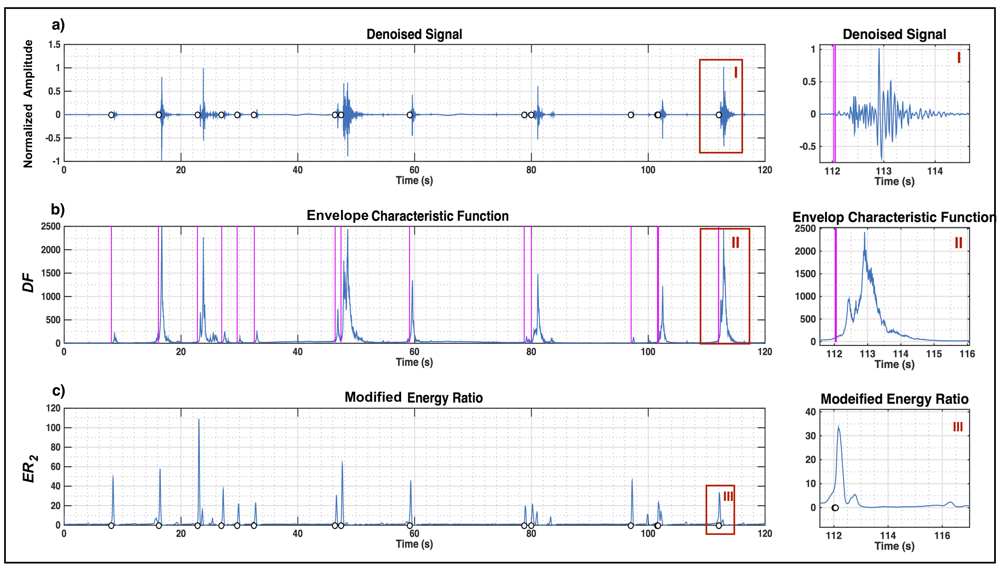
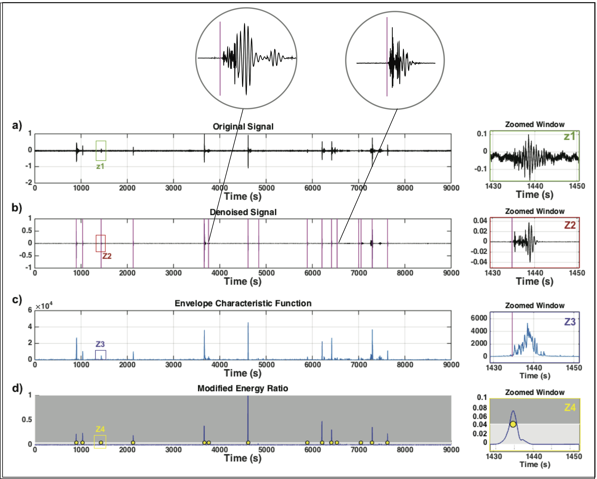

# Automatic Microseismic Denoising and Onset Detection
----------------------------------------------------------
This repository contains MATLAB scripts and sample data for applying denoising method presented in: 

`Mousavi, S. M., C. A. Langston, and S. P. Horton (2016). Automatic Microseismic Denoising and Onset
Detection Using the Synchrosqueezed-Continuous Wavelet Transform. Geophysics, 81(4), V341-V355,
doi:10.1190/GEO2015-0598.1`

These functions are just for demonstration of the method and you may need to modify codes extensivly to be able to make it works on your dataset.

you need `MATLAB statistics` and `signal processing` toolboxes to run this code.

## Paper
(https://www.researchgate.net/publication/303909320_Automatic_microseismic_denoising_and_onset_detection_using_the_synchrosqueezed_continuous_wavelet_transform)

## Talk 
(https://earthquake.usgs.gov/contactus/menlo/seminars/1093)

## Abstract 
Typical microseismic data recorded by surface arrays are characterized by low signal-to-noise ratios (S/Ns) and highly nonstationary noise that make it difficult to detect small events. Currently, array or crosscorrelation-based approaches are used to enhance the S/N prior to processing. We have developed an alternative approach for S/N improve-ment and simultaneous detection of microseismic events. The proposed method is based on the synchrosqueezed continuous wavelet transform (SS-CWT) and custom thresholding of single-channel data. The SS-CWT allows for the adaptive filtering of time and frequency-varying noise as well as offering an improvement in resolution over the conventional wavelet transform. Simultaneously, the algorithm incorporates a detection procedure that uses the thresholded wavelet coefficients and detects an arrival as a local maxima in a characteristic function. The algorithm was tested using a synthetic signal and field microseismic data, and our results have been compared with conventional denoising and detection methods. This technique can remove a large part of the noise from small-amplitudes signal and detect events as well as estimate onset time.

## A Short Description 
Seismic data recorded by surface arrays are often contaminated by unwanted noise. In many conventional seismic methods, 
the reliability of the seismic data and accuracy of parameter extraction, such as onset time, polarity, and amplitude, 
are directly affected by the background noise level. As a result, the accuracy of event location and other attributes 
derived from seismic traces are also influenced by the noise content. Therefore, there is a great need for developing 
suitable procedures that improve signal-to-noise ratios allowing for robust seismic processing. In this presentation, 
I introduce four different methods for automatic denoising of seismic data. These methods are based on the time-frequency 
thresholding approach. The efficiency and performance of the thresholding-based method for seismic data have been improved 
significantly. Proposed methods are automatic and data driven in the sense that all the filter parameters for denoising are 
dynamically adjusted to the characteristics of the signal and noise. These algorithms are applied to single channel data 
analysis and do not require large arrays of seismometers or coherency of arrivals across an array. Hence, they can be applied
to every type of seismic data and can be combined with other array based methods. Results show these methods can improve 
detection of small magnitude events and accuracy of arrival time picking.

 
a) Two-minute vertical component re-cording of microseismic events induced by wastewater injection in central Arkansas. Events are re-corded by a broadband sensor, station CH2 at35.3341N,−92.2982W, at the surface in 2011.Hypocentral distances range between 1.7 and2.5 km and event size ranges between−0.5and0.38Mw. (b) Histogram of the stacked functionCF. The smoothed function used for the Gaussianfit is shown by the green line. The optimal scalevalue for separating long-period and high-fre-quency coefficients selected by Otsu’s methodis  shown  with  the  horizontal  magenta  line.(c) The continuous wavelet scalogram of data.(d) The scalogram of the low-frequency segment.(e) The scalogram of the high-frequency segmentand presignal noise section. (f) The function DF(equation15) showing the cumulative energy dis-tribution. Black lines define the arrival of high-en-ergy signals.Microseismic denoising and detectionV345Downloaded 06/27/16 to 141.225.156.224. Redistribution subject to SEG license or copyright; see Terms of Use at http://library.seg.org/
  
(a) Two-minute vertical component recording of microseismic events induced by waste water injection in central Arkansas. Events are recorded by a broadband sensor, station CH2 at 35.3341N, −92.2982W, at the surface in 2011. Hypocentral distances range between 1.7 and 2.5 km and event size ranges between −0.5 and 0.38 Mw. (b) Histogram of the stacked function
CF. The smoothed function used for the Gaussian fit is shown by the green line. The optimal scale value for separating long-period and high-frequency coefficients selected by Otsu’s method is shown with the horizontal magenta line.
(c) The continuous wavelet scalogram of data. (d) The scalogram of the low-frequency segment.
(e) The scalogram of the high-frequency segment and presignal noise section. (f) The function DF (equation 15) showing the cumulative energy distribution. Black lines define the arrival of high-energy signals.

(a) Original seismogram of several microseismic events induced by waste fluid injection in central Arkansas. (b) The SS-CWT
spectrum of the original data, (c) denoised seismogram and (d) associated spectrogram, respectively, (e) magnified windows of the original and (f) denoised signal around one event, respectively. (g and h) The SS-CWT representations of the same event as panels (e and f). The X and XX indicate the magnified boxes (g and h), respectively.

(a) The denoised signal and detected events indicated by open circles. In addition, a magnified window gives a closer view of one detected event. (b) The envelope characteristic function DF, and onset detections (vertical lines). (c) Modified energy ratio ER2. Circles are indication of detected events where local maxima of ER2 pass the threshold value. Vertical lines indicate onset times of seismic events and are associated with the time when value of DF start to rise (positive slope) and coincide with the local maxima of ER2.

Field microseismic data after the denoising and detection using the proposed method. (a) Vertical ground motion showing microseismic events recorded at station LA14 at Bayou Corne, Louisiana, in October 2013 and a magnified window (Z1) around a selected event.
(b) The denoised seismogram using the proposed method and a magnified window (Z2) showing a closer view of the event after denoising onset pick. Vertical lines indicate onset-time estimations associated with local maxima and triggering points on the energy ratio function. Two magnified windows on top show extra events detected by this method compared with the STA/LTA. (c) The characteristic function DF, calculated from the energy envelope. (d) The blue solid line is the ER2 function, the light gray area shows the threshold limit (15% of max) for the detection triggering, and the circles indicate local maxima in the ER2 that pass the threshold limit. The magnified window (Z4) shows the function associated to one detected event.
